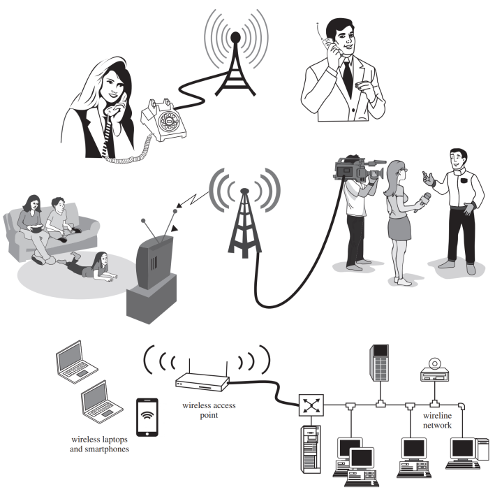
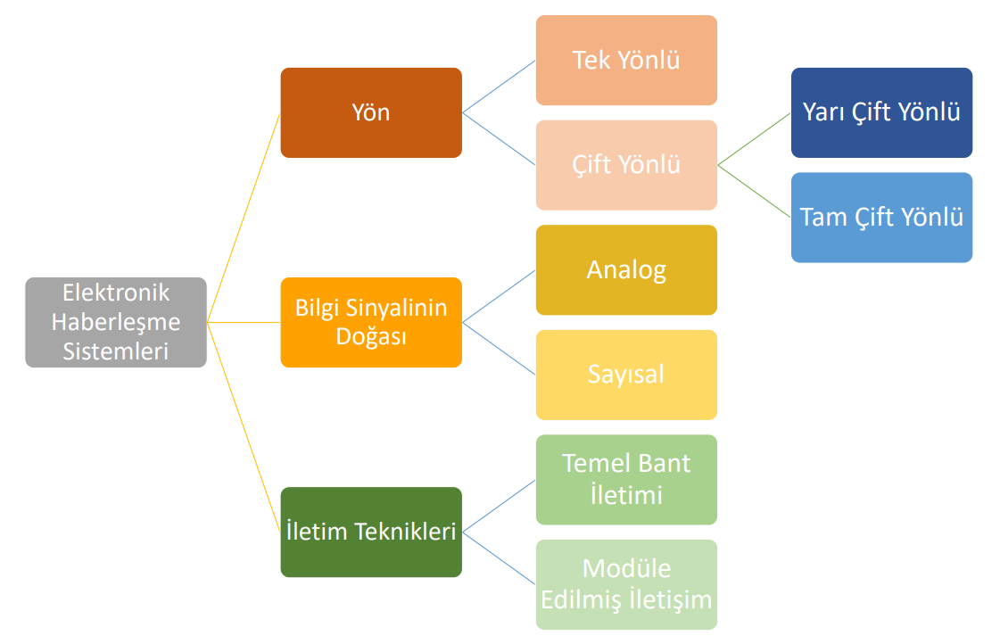
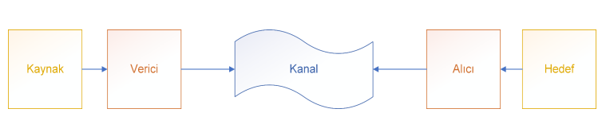
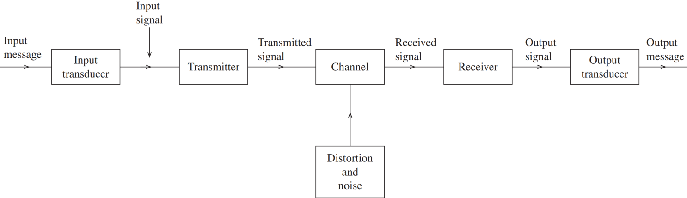
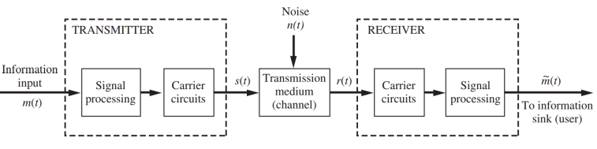
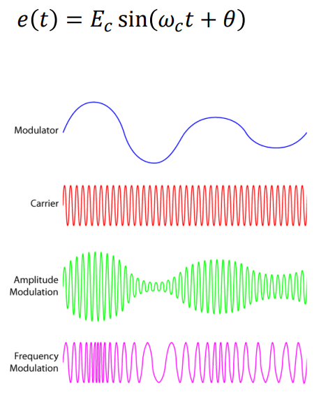
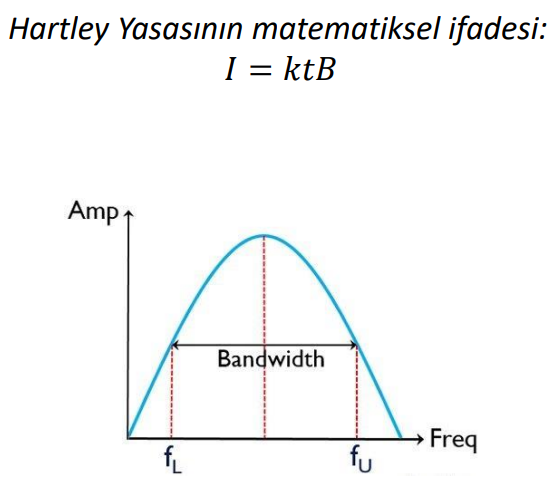
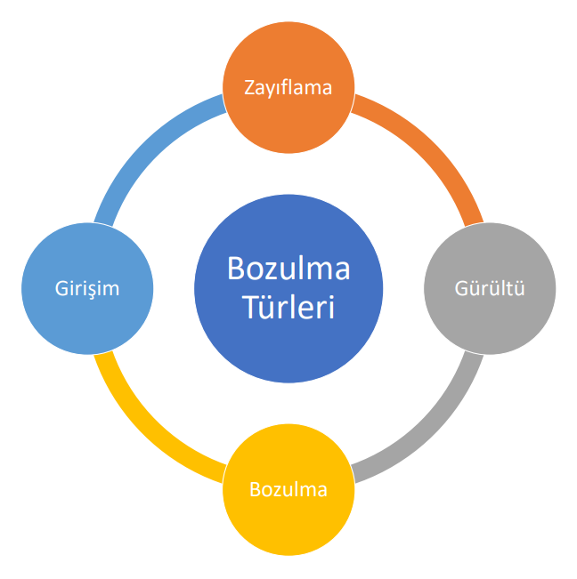

# Haberleşme Sistemlerine Giriş

\- 1837: Samuel Morse’un telgrafı, ticari olarak başarılı ilk elektriksel haberleşme sistemi olmuştur.

\- İlk haberleşme sistemleri bir verici, alıcı ve iletim ortamından oluşuyordu.

\- 1876: Alexander Graham Bell, uzun mesafeli ses iletişimini mümkün kılan telefonu icat etti.

\- Vakum tüplerinin ve daha sonra transistörlerin geliştirilmesi, sinyal yükseltmesini ve daha geniş kapsama alanını mümkün kıldı.

\- 1920’lere gelindiğinde, radyo yayıncılığı ve erken dönem televizyon, modern haberleşme ağlarının temelini oluşturdu.

  

## Haberleşme Sistemleri

\- Haberleşme çok geniş bir alan ve uygulama yelpazesini kapsar. Bu bağlamda haberleşme, "bir noktadan başka bir noktaya bilginin iletimidir." Başlangıçta sadece telekomünikasyon(uzun mesafeli iletişim) olarak
bilinmekteydi.

 \- Modern sistemler şu ortamlarda çalışabilir:
 * Uzun mesafeler(uydular, yayıncılık)
 * Kısa mesafeler(Bluetooth, Wi-Fi, yerel ağlar)

Haberleşme sistemleri günlük yaşamın bir parçasıdır:
 * Telefon, radyo, televizyon ve internet
 * Gemiler, uçaklar ve uydular için küresel bağlantı
 * Çevresel izleme ve sensör ağları

  

## Haberleşme Tipleri

  

Tek yönlü haberleşme türüne TV yayıncılığını örnek verebiliriz: Merkezden Sinyal --> Kullanıcı

Çift Yönlü haberleşme türü ikiye ayrılır: Yarı Çift Yönlü ve Tam Çift Yönlü olmak üzere. Yarı Çift Yönlü haberleşme türünde Transmitter(TX), Receiver'a(RX) sinyal gönderebilir. Geri de alabilir. Fakat bu işlemler aynı anda gerçekleşemez. Modern haberleşmeye uygun olan haberleşme yönü Tam Çift Yönlü haberleşmedir. Örneğin bir akıllı cep telefonu.

## Haberleşme Sisteminin Elemanları

**Temel Haberleşme Sistemi Kavramı**

 \- Bir haberleşme sistemi bilgiyi bir kaynaktan hedefe aktarır. Bilgi bir kaynak üzerinden iletilir. Sinyalin düzgün iletimi için bir verici ve alıcı gereklidir.
 
 \- Bu temel model, tüm haberleşme sistemlerinin temelini oluşturur.

**Kaynak(Source)**

 \- Mesajı üretir (ses, görüntü, veri, video, metin).

 \- Kaynak sinyalleri şu şekilde olabilir:
 
* Analog (ses, video)
* Sayısal (veri, sayısal bilgi)

\- Elektriksel olmayan mesajlar, giriş dönüştürücüleri kullanılarak elektriksel sinyallere
dönüştürülür:

* Mikrofon, klavye, kamera
  
\- Kaynaklar frekans aralıkları (bant genişliği) ile karakterize edilir:

* Telefon sesi: ~300 Hz – 3 kHz
* Yüksek kaliteli ses: ~20 Hz – 20 kHz
* Televizyon videosu: DC – ~4.2 MHz

  

**Hedef(Destination)**

* Haberleşmenin sona erdiği noktadır.
* Çıkış dönüştürücü, elektriksel sinyali tekrar orijinal formuna dönüştürür.
* Örnek: Hoparlör, ekran, depolama aygıtı

  

  

  

  

Elektriksel olmayan sinyal(ses, video, mesaj) önce **Input Transducer(Giriş Dönüştürücüsü)** kısmında elektriksel sinyale dönüştürülür. Bu işlemden sonra sinyal; düşük enerji, düşük sinyal haline gelir. **Transmitter(iletici)** sayesinde sinyali, yüksek frekans ve yüksek enerjili sinyal haline getiririz. Daha sonra **Kanal** içerisinde **Bozulma** ve **Gürültü** devreye girebiliyor. Sinyal **Receiver(Alıcı)** kısmına gelince bu olaylardan dolayı tekrardan düşük frekanslı ve enerjili hale gelir. Burada gerekli yükseltme işlemleri yapıldıktan sonra sinyal **Output Transducer(Çıkış Dönüştürücüsü)** kısmına gelir. (Unutmamak gerek ki, sinyal bu kısımlara gelene kadar elektriksel bir sinyaldi.) Sinyal en son çıkış kısmında elektriksel olmayan sinyale dönüştürüldükten sonra başarılı bir şekilde iletimi gerçekleştirilir.

  

## Bilgi(Information)

\- Haberleşme sistemlerinde bilgi:

* Bir kaynak tarafından üretilir
* Bir sinyale kodlanır
* Bir kanal üzerinden iletilir
* Alıcıda yeniden elde edilir
  
\- Bir haberleşme sisteminin temel amacı, bilgiyi doğru ve verimli bir
şekilde aktarmaktır.

## Modülasyon(Modulation)

Modülasyon, verimli ve güvenilir iletim için temel bant bilgilerini, genliğini, frekansını veya fazını değiştirerek yüksek frekanslı bir
taşıyıcıya dönüştürmeye denir.

\- Temel bant (bilgi) sinyali, taşıyıcının bir parametresini değiştirir.

\- Değiştirilebilen taşıyıcı parametreleri:

* Genlik (𝐸𝑐)
* Frekans (𝜔𝑐)
* Faz (𝜃)
  
\- Modülasyon verici tarafında gerçekleştirilir. Demodülasyon (algılama) alıcı tarafında gerçekleştirilerek temel bant
sinyali geri elde edilir.

  

## Sinyal Bant Genişliği(Signal Bandwith)

\- Bant genişliği, bir sistemin etkin şekilde iletebildiği veya alabileceği frekans aralığıdır. Genellikle alt ve üst frekans sınırları arasındaki fark olarak ölçülür.

\- Gerekli bant genişliği şunlara bağlıdır:

* Temel bant frekans aralığı (analog sistemlerde)
* Veri hızı (sayısal sistemlerde)
* Kullanılan modülasyon tekniği
  
\- Modülasyon bant genişliğini artırır ancak şunları mümkün kılar:
* Verimli iletim
* Pratik anten boyutları
* Daha yüksek bilgi hızları

**Hartley Yasası**

\- Hartley Yasası, bant genişliği ile bilgi kapasitesi arasındaki ilişkiyi ifade eder.

\- İletilen bilgi miktarı kanal bant genişliği ile orantılıdır. Farklı modülasyon teknikleri bant genişliğini farklı verimlilikle kullanır.

  

𝐼: Gönderilecek bilgi miktarı

𝑘: Modülasyon türüne bağlı sabit

𝑡: Mevcut süre

𝐵: Kanal bant genişliği

## Haberleşme Sistemlerinde Kanal Bozulmaları

Haberleşme kanalı, iletilen sinyali aşağıdaki etkiler nedeniyle değiştirir:

\- **Zayıflama(Attenuation)**: Sinyal kanal boyunca yayılırken gücünün
azalmasıdır ve alıcıda daha zayıf sinyallerin elde edilmesine neden
olur.

\- **Gürültü(Noise)**: Sinyal kalitesini bozan ve sinyal-gürültü oranını (SNR)
düşüren, istenmeyen rastgele bozucu etkiler(örneğin termal gürültü).

\- **Bozulma(Distortion)**: Kanalın frekansa bağlı özellikleri nedeniyle
sinyal şeklinde meydana gelen değişimlerdir. Dalga biçiminin
yayılmasına veya semboller arası girişime(ISI) neden olabilir.

\- **Girişim(Interference)**: Aynı veya komşu frekans bantlarında çalışan
diğer vericilerden kaynaklanan sinyal bozulmasıdır.

Bu etkiler birlikte sistemin güvenilirliğini, veri hızını ve genel
performansını düşürür.

  

